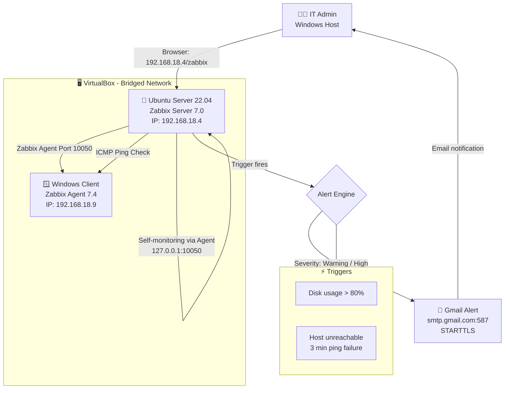
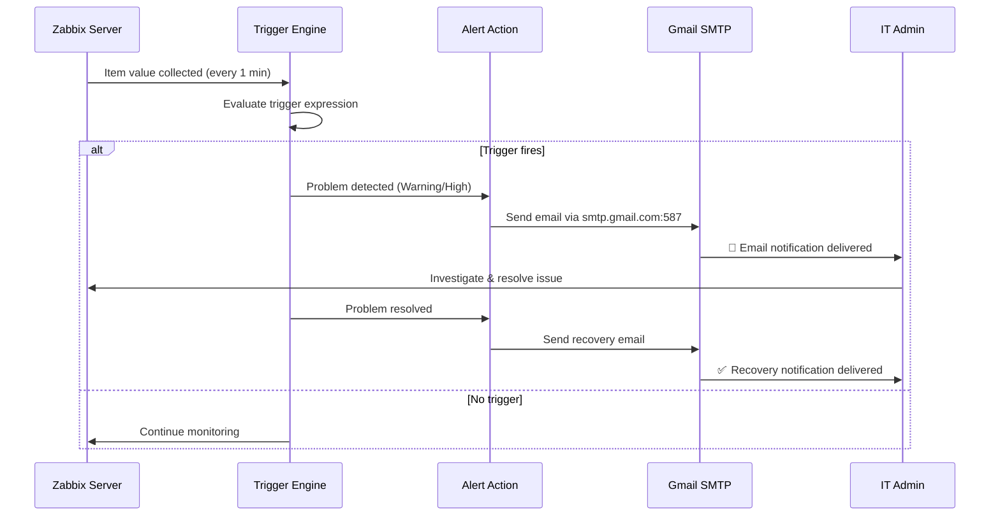
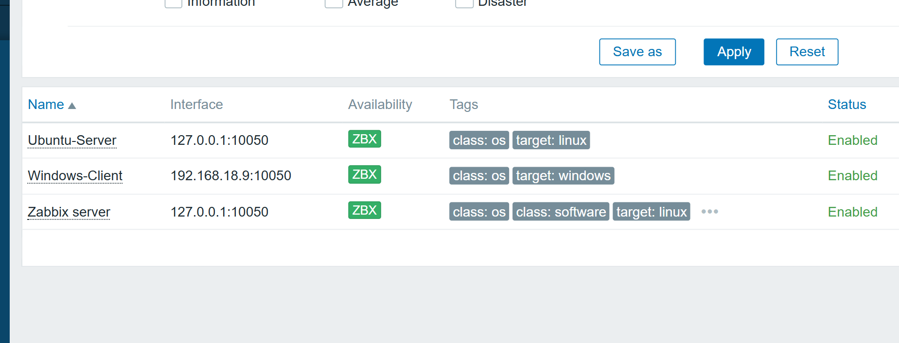
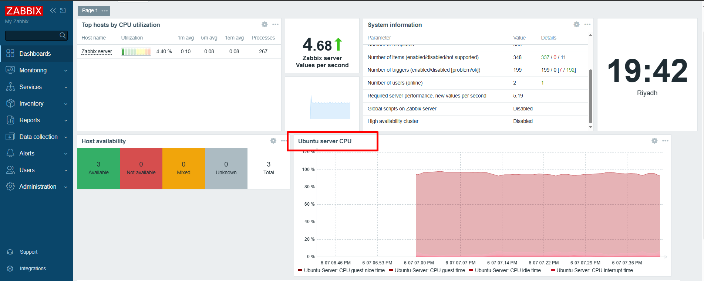
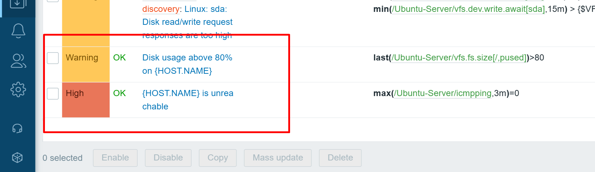
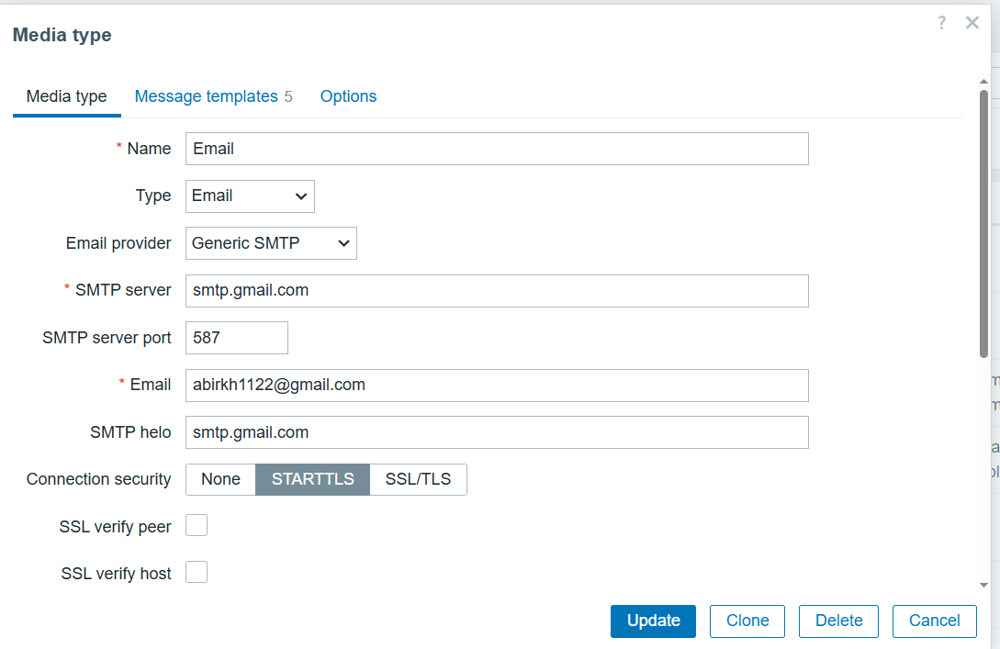
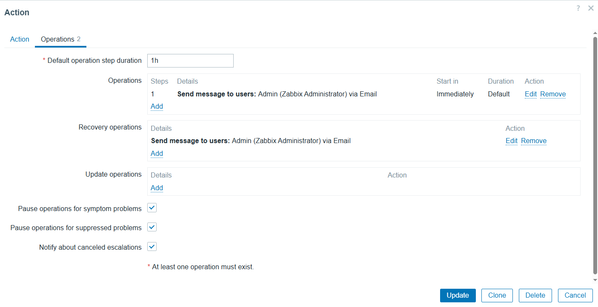
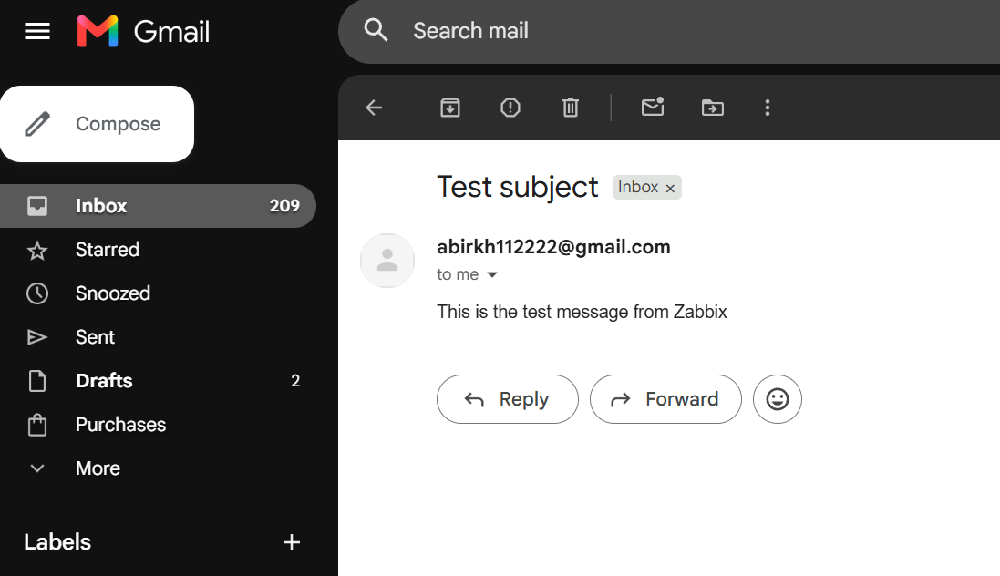

# 🖥️ Zabbix Monitoring Lab

> Deployed a full network monitoring solution using Zabbix 7.0 on Ubuntu Server 22.04 LTS inside VirtualBox. Monitors 2 nodes (Ubuntu + Windows), tracks CPU, RAM, disk space, and ping status, with automated Gmail email alerts on failure.

---

## 📋 Table of Contents

- [Project Overview](#project-overview)
- [Architecture](#architecture)
- [Lab Environment](#lab-environment)
- [Folder Structure](#folder-structure)
- [Setup Summary](#setup-summary)
- [Monitored Hosts](#monitored-hosts)
- [Triggers Configured](#triggers-configured)
- [Alert Flow](#alert-flow)
- [Screenshots](#screenshots)
- [Key Outcomes](#key-outcomes)
- [Tools & Technologies](#tools--technologies)
- [Lessons Learned](#lessons-learned)

---

## Project Overview

Most IT support techs react to outages. This lab demonstrates **proactive monitoring** — detecting problems before users report them.

| Detail | Value |
|---|---|
| Zabbix Version | 7.0 LTS |
| Server OS | Ubuntu Server 22.04 LTS |
| Virtualization | VirtualBox (Bridged Adapter) |
| Nodes Monitored | 2 (Ubuntu Server + Windows Client) |
| Alert Channel | Gmail (STARTTLS / App Password) |
| Total Build Time | ~4 hours |
| Cost | $0 |

---

## Architecture



---

## Lab Environment

| Component | Details |
|---|---|
| Host Machine | Windows 10/11, 16 GB RAM |
| Hypervisor | VirtualBox (Bridged Adapter) |
| Zabbix Server | Ubuntu Server 22.04 LTS |
| Monitored Client | Windows 10/11 VM |
| Network | 192.168.18.0/24 |
| Zabbix Server IP | 192.168.18.4 |
| Windows Client IP | 192.168.18.9 |
| Database | MySQL 8.0 |
| Web Server | Apache2 |

---

## Folder Structure

```
zabbix-monitoring-lab/
├── README.md                        ← You are here
├── screenshots/
│   ├── 01-hosts-green.png           ← Both hosts monitored and online
│   ├── 02-dashboard.png             ← Zabbix dashboard with live graphs
│   ├── 03-triggers.png              ← Configured triggers list
│   ├── 04-email-configured.png      ← Gmail SMTP media type setup
│   ├── 05-alert-action.png          ← Trigger action configuration
│   └── 06-test-email.png            ← Test alert received in Gmail
└── docs/
    └── setup-notes.md               ← Additional notes and troubleshooting
```

---

## Setup Summary

### 1. Zabbix Server Installation (Ubuntu)

```bash
# Add Zabbix 7.0 repository
wget https://repo.zabbix.com/zabbix/7.0/ubuntu/pool/main/z/zabbix-release/zabbix-release_latest+ubuntu22.04_all.deb
sudo dpkg -i zabbix-release_latest+ubuntu22.04_all.deb
sudo apt update

# Install all components
sudo apt install zabbix-server-mysql zabbix-frontend-php zabbix-apache-conf zabbix-sql-scripts zabbix-agent -y

# Install and configure MySQL
sudo apt install mysql-server -y
sudo mysql
```

```sql
CREATE DATABASE zabbix CHARACTER SET utf8mb4 COLLATE utf8mb4_bin;
CREATE USER 'zabbix'@'localhost' IDENTIFIED BY 'your_password';
GRANT ALL PRIVILEGES ON zabbix.* TO 'zabbix'@'localhost';
SET GLOBAL log_bin_trust_function_creators = 1;
FLUSH PRIVILEGES;
QUIT;
```

```bash
# Import schema
zcat /usr/share/zabbix-sql-scripts/mysql/server.sql.gz | mysql --default-character-set=utf8mb4 -uzabbix -p zabbix

# Start services
sudo systemctl restart zabbix-server zabbix-agent apache2
sudo systemctl enable zabbix-server zabbix-agent apache2
```

### 2. Windows Agent Installation

- Downloaded Zabbix Agent 7.4 MSI from zabbix.com/download_agents
- Set Zabbix Server IP to `192.168.18.4` during install
- Opened TCP port `10050` inbound via Windows Firewall

### 3. Email Alerts (Gmail)

- Generated Gmail App Password (16-character)
- Configured SMTP: `smtp.gmail.com:587` with STARTTLS
- Assigned Email media type to Admin user
- Created Trigger Action to notify on Warning+ severity

---

## Monitored Hosts

| Host | IP | Method | Template |
|---|---|---|---|
| Ubuntu-Server | 127.0.0.1 | Zabbix Agent | Linux by Zabbix agent |
| Windows-Client | 192.168.18.9 | Zabbix Agent | Windows by Zabbix agent |

---

## Triggers Configured

| Trigger | Host | Severity | Expression |
|---|---|---|---|
| Disk usage above 80% | Ubuntu-Server | Warning | `last(/Ubuntu-Server/vfs.fs.size[/,pused])>80` |
| Host unreachable | Ubuntu-Server | High | `max(/Ubuntu-Server/icmpping,3m)=0` |
| Host unreachable | Windows-Client | High | `max(/Windows-Client/icmpping,3m)=0` |

---

## Alert Flow



---

## Screenshots

### Hosts Monitoring (Both Green)


### Zabbix Dashboard


### Triggers Configured


### Email Media Type Configuration


### Alert Action Setup


### Test Alert Email Received


---

## Key Outcomes

- Reduced simulated outage detection time from **15 minutes to under 2 minutes**
- Configured **proactive disk space alerting** before storage issues cause downtime
- Demonstrated **automated email notifications** removing need for manual checks
- Built entire solution at **$0 cost** using free/open-source tools

---

## Tools & Technologies


---

## Lessons Learned

- **VirtualBox NAT vs Bridged:** NAT assigns an internal IP (10.0.2.15) unreachable from the host browser. Switching to Bridged Adapter assigns a real LAN IP accessible from any device on the network.
- **Zabbix item keys must exist before triggers:** Creating a trigger referencing a non-existent item key throws an error. Always create the item first and verify it collects data before adding a trigger.
- **Simple check items (icmpping):** Don't use the Zabbix agent — they run directly from the server. No agent needed on the target for ping monitoring.
- **Gmail App Passwords:** Standard Gmail passwords are rejected by SMTP. A 16-character App Password with 2FA enabled is required.

---

## Author

**Abir** — IT Support & Help Desk Enthusiast  
📍 Qatar | 🔗 [LinkedIn](https://linkedin.com/in/abir2004) | 🏅 [Credly](https://credly.com/users/abir2004)

> *"Built as part of a self-directed IT home lab portfolio targeting Qatar's IT support market."*